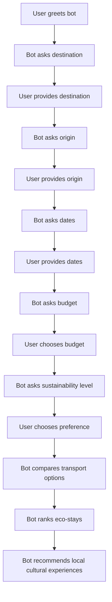
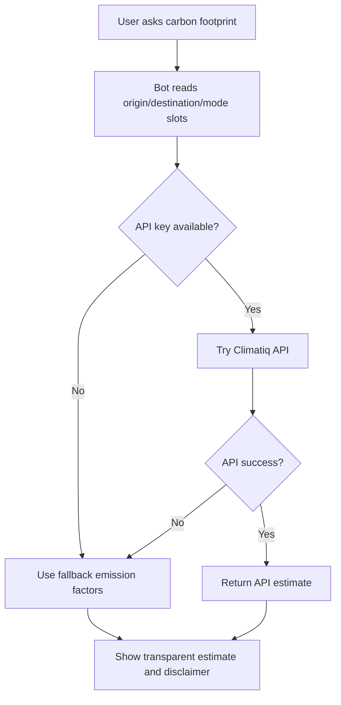
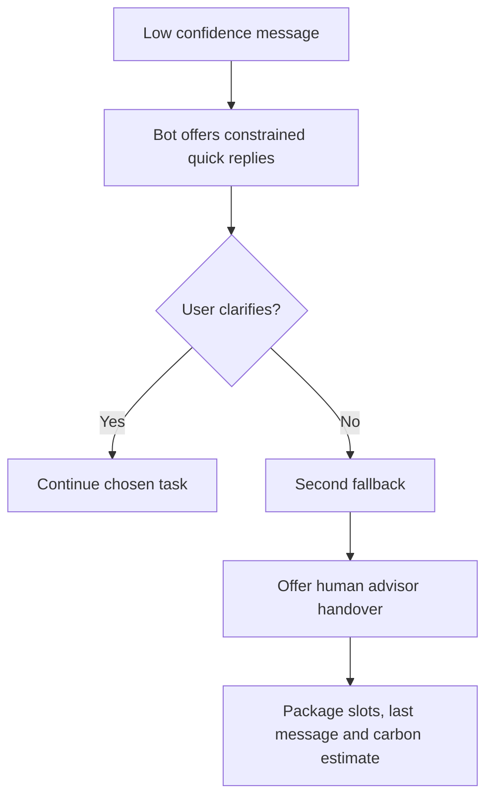

# Conversation Flows

## Flow 1: Sustainable city break

```mermaid
flowchart TD
A[User greets bot] --> B[Bot asks destination]
B --> C[User provides destination]
C --> D[Bot asks origin]
D --> E[User provides origin]
E --> F[Bot asks dates]
F --> G[User provides dates]
G --> H[Bot asks budget]
H --> I[User chooses budget]
I --> J[Bot asks sustainability level]
J --> K[User chooses preference]
K --> L[Bot compares transport options]
L --> M[Bot ranks eco-stays]
M --> N[Bot recommends local cultural experiences]
```

## Flow 2: Carbon footprint comparison

```mermaid
flowchart TD
A[User asks carbon footprint] --> B[Bot reads origin/destination/mode slots]
B --> C{API key available?}
C -->|Yes| D[Try Climatiq API]
C -->|No| E[Use fallback emission factors]
D --> F{API success?}
F -->|Yes| G[Return API estimate]
F -->|No| E
E --> H[Show transparent estimate and disclaimer]
G --> H
```

## Flow 3: Two-stage clarification and human handover

```mermaid
flowchart TD
A[Low confidence message] --> B[Bot offers constrained quick replies]
B --> C{User clarifies?}
C -->|Yes| D[Continue chosen task]
C -->|No| E[Second fallback]
E --> F[Offer human advisor handover]
F --> G[Package slots, last message and carbon estimate]
```
